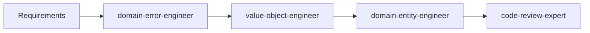
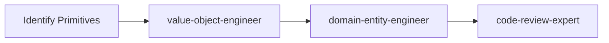
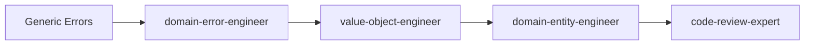

# Agent Collaboration Matrix for Zenvestor

This document defines when to use each specialized agent and how they work together to deliver high-quality domain-driven code.

## Shared Foundation

All agents must follow these shared resources:
- `.claude/agents/shared/design-principles.md` - Core design principles (YAGNI, KISS, DRY, SOLID, etc.)
- `.claude/agents/shared/tdd-principles.md` - Test-Driven Development approach
- `.claude/agents/shared/error-patterns.md` - Comprehensive error handling patterns
- `.claude/agents/shared/code-examples.md` - Reusable code patterns
- `.claude/agents/shared/anti-patterns.md` - Patterns to avoid

## Agent Overview

| Agent | Primary Purpose | When to Use | Key Outputs |
|-------|----------------|-------------|-------------|
| **value-object-engineer** | Create immutable domain values with validation | Need to encapsulate domain concepts, validate inputs, replace primitives | Value objects with factory methods, validation errors, tests |
| **domain-entity-engineer** | Build behavior-rich entities and aggregates | Need stateful domain objects, business logic, state machines | Entities with methods, state transitions, aggregate roots, tests |
| **domain-error-engineer** | Design comprehensive error handling | Need specific error types, error hierarchies, recovery strategies | Error classes, error handling patterns, tests |
| **code-review-expert** | Review code for DDD/Clean Architecture compliance | After implementing features, before commits, quality checks | Review feedback, improvement suggestions, pattern compliance |

## Sequential Collaboration Patterns

### Pattern 1: Building a New Domain Feature



**Example**: Implementing stock portfolio management

1. **domain-error-engineer**: Define PortfolioError hierarchy
2. **value-object-engineer**: Create PortfolioName, AllocationPercentage value objects
3. **domain-entity-engineer**: Build Portfolio aggregate with add/remove stock methods
4. **code-review-expert**: Verify DDD patterns and suggest improvements

### Pattern 2: Refactoring Primitive Obsession



**Example**: Replacing string emails with Email value object

1. **value-object-engineer**: Create Email value object with validation
2. **domain-entity-engineer**: Update User entity to use Email instead of String
3. **code-review-expert**: Ensure all usages are updated consistently

### Pattern 3: Improving Error Handling



**Example**: Replacing generic exceptions with domain errors

1. **domain-error-engineer**: Design specific error types for each failure mode
2. **value-object-engineer**: Update factories to return new error types
3. **domain-entity-engineer**: Update entity methods to use new errors
4. **code-review-expert**: Verify error handling is comprehensive

## Parallel Collaboration Patterns

### Pattern 4: Domain Model Creation

Multiple agents can work in parallel when creating independent components:

```
┌─────────────────────┐     ┌─────────────────────┐     ┌─────────────────────┐
│ value-object-engineer│     │ value-object-engineer│     │domain-error-engineer│
│ Creates: StockTicker │     │ Creates: StockPrice │     │ Creates: StockError │
└─────────────────────┘     └─────────────────────┘     └─────────────────────┘
           │                           │                           │
           └───────────────────────────┴───────────────────────────┘
                                      │
                           ┌─────────────────────┐
                           │domain-entity-engineer│
                           │  Creates: Stock      │
                           └─────────────────────┘
                                      │
                           ┌─────────────────────┐
                           │ code-review-expert   │
                           │  Reviews all code    │
                           └─────────────────────┘
```

## Decision Matrix: Which Agent to Use

### Starting Point Questions

1. **Are you creating a new domain concept?**
   - If it has no behavior → value-object-engineer
   - If it has behavior/state → domain-entity-engineer

2. **Are you handling failures?**
   - If defining error types → domain-error-engineer
   - If implementing validation → value-object-engineer

3. **Are you refactoring existing code?**
   - If extracting primitives → value-object-engineer
   - If adding behavior → domain-entity-engineer
   - If improving errors → domain-error-engineer
   - Always finish with → code-review-expert

4. **Are you implementing business logic?**
   - If stateless calculation → value-object-engineer (as method)
   - If stateful operation → domain-entity-engineer
   - If operation can fail → start with domain-error-engineer

## Interaction Examples

### Example 1: Creating a Trading System

**User**: "I need to create a trading system that can place buy/sell orders with validation"

**Workflow**:
1. Use **domain-error-engineer** to create:
   - OrderError hierarchy (InvalidQuantityError, InsufficientFundsError, etc.)
   
2. Use **value-object-engineer** to create:
   - OrderQuantity (must be positive)
   - OrderPrice (must be within market limits)
   - OrderType (buy/sell enum)

3. Use **domain-entity-engineer** to create:
   - Order entity with place(), cancel(), fill() methods
   - TradingAccount aggregate managing orders

4. Use **code-review-expert** to:
   - Verify all components follow DDD
   - Check test coverage
   - Suggest improvements

### Example 2: Adding Email Verification

**User**: "Add email verification to user registration"

**Workflow**:
1. Use **domain-error-engineer** to create:
   - EmailVerificationError types
   - VerificationTokenError types

2. Use **value-object-engineer** to create:
   - VerificationToken with expiry
   - VerificationCode with format validation

3. Use **domain-entity-engineer** to:
   - Add verification state to User entity
   - Implement verify() method with state transition

4. Use **code-review-expert** to verify the implementation

## Anti-Patterns to Avoid

### 1. Wrong Agent Selection
```
❌ Using domain-entity-engineer for simple values
❌ Using value-object-engineer for stateful objects
❌ Skipping domain-error-engineer when operations can fail
❌ Skipping code-review-expert before committing
```

### 2. Poor Sequencing
```
❌ Creating entities before their value objects
❌ Implementing features before defining errors
❌ Reviewing code before implementation is complete
```

### 3. Isolation Mistakes
```
❌ Mixing concerns between agents
❌ Having one agent fix another's output
❌ Duplicating work across agents
```

## Best Practices for Agent Collaboration

### 1. Clear Handoffs
When transitioning between agents, provide:
- Summary of work completed
- List of created components
- Any assumptions or decisions made
- Next steps needed

### 2. Consistent Context
All agents should:
- Follow the same project conventions
- Use the same test patterns
- Reference shared documentation
- Maintain consistent naming

### 3. Iterative Refinement
- Start with domain-error-engineer for error design
- Use value-object-engineer for building blocks
- Use domain-entity-engineer for business logic
- Always end with code-review-expert

### 4. Parallel Work
When possible, run agents in parallel:
- Multiple value objects can be created simultaneously
- Error hierarchies can be designed while entities are built
- Reviews can happen incrementally

## Communication Templates

### Requesting Value Object Creation
"Create a [Name] value object that validates [rules]. It should [behavior]."

### Requesting Entity Creation
"Create a [Name] entity that can [operations]. It should maintain [invariants]."

### Requesting Error Design
"Design errors for [feature] that handle [failure scenarios]."

### Requesting Code Review
"Review the [component] implementation for DDD compliance and best practices."

## Measuring Success

Good agent collaboration results in:
1. **Consistent Code**: All components follow the same patterns
2. **Comprehensive Tests**: Every component has thorough test coverage
3. **Clear Errors**: Every failure mode has a specific error type
4. **Type Safety**: No primitive obsession or dynamic types
5. **Clean Architecture**: Clear separation between layers

## Summary

The key to successful agent collaboration is:
1. **Choose the right agent** for each task
2. **Sequence work logically** (errors → values → entities → review)
3. **Maintain context** between agent transitions
4. **Always review** before considering work complete

This ensures that the Zenvestor codebase maintains high quality and consistency across all domain implementations.