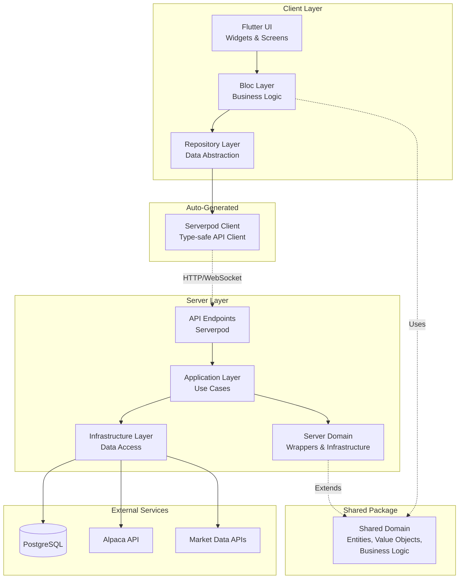
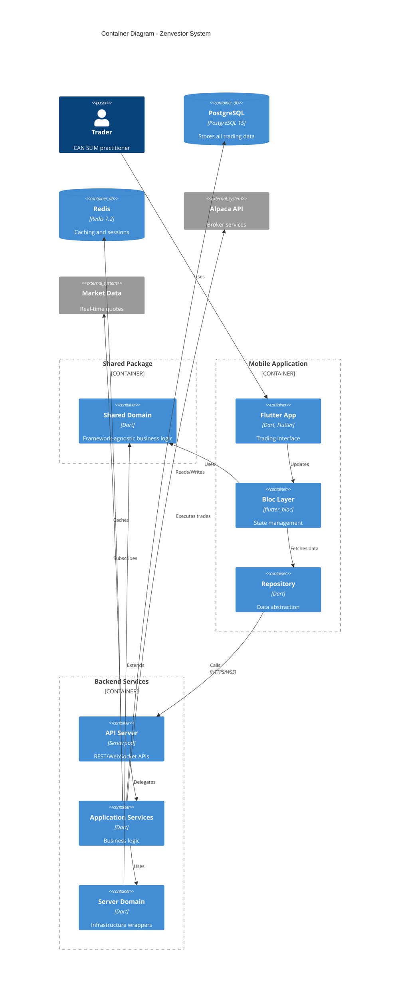
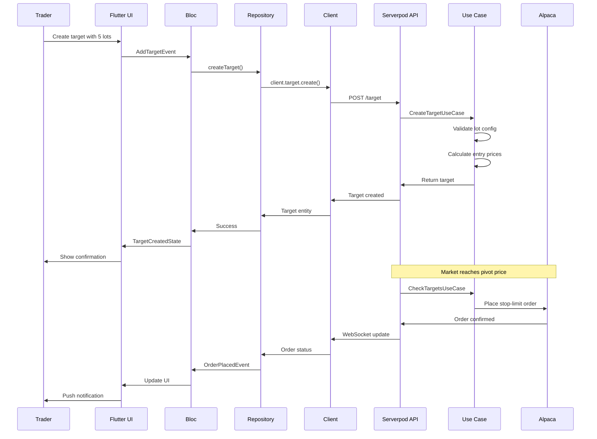

# Zenvestor Architecture Document

## Introduction

This document outlines the overall project architecture for Zenvestor, including backend systems, shared services, and non-UI specific concerns. Its primary goal is to serve as the guiding architectural blueprint for AI-driven development, ensuring consistency and adherence to chosen patterns and technologies.

**Relationship to Frontend Architecture:**
Given our monorepo structure with Serverpod's client generation, this document covers both backend and frontend architectural decisions. The Clean Architecture principles apply across the entire stack, with specific adaptations for Serverpod and Bloc patterns.

### Starter Template or Existing Project

We will use Serverpod's project initialization tool which provides:
- Pre-configured monorepo structure
- Client code generation setup
- Database migrations tooling
- Docker configuration for PostgreSQL
- Basic project scaffolding

### Change Log

| Date | Version | Description | Author |
|------|---------|-------------|--------|
| 2024-01-XX | 1.0 | Initial architecture document | Winston (Architect) |

## High Level Architecture

### Technical Summary

Zenvestor implements a Clean Architecture approach using Dart across the full stack with a shared domain package. The system uses Serverpod for backend API development with auto-generated type-safe client code, Flutter with Bloc for state management on the frontend, and PostgreSQL for data persistence. The architecture features a framework-agnostic shared domain package containing business logic that is reused between server and Flutter applications. This approach prioritizes maintainability through strict layer separation and code reuse while leveraging the unique strengths of Serverpod's code generation and Bloc's reactive patterns to create a sophisticated yet manageable trading platform.

### High Level Overview

The architecture follows these key decisions from the PRD:
1. **Monorepo Structure**: Single repository containing server, client, Flutter applications, and shared packages
2. **Shared Domain Package**: Framework-agnostic business logic shared between server and Flutter
3. **Service Architecture**: Client-server architecture with clear API boundaries
4. **Clean Architecture**: Strict separation of concerns across all layers
5. **Reactive State Management**: Bloc pattern for predictable state updates
6. **Code Generation**: Serverpod's auto-generated client for type safety

### High Level Project Diagram



### Architectural and Design Patterns

- **Clean Architecture:** Concentric layers with dependency rule pointing inward - _Rationale:_ Ensures business logic remains independent of frameworks and external services
- **Shared Domain Package:** Framework-agnostic domain logic - _Rationale:_ Reuse business logic between server and Flutter, maintain single source of truth
- **Repository Pattern:** Abstract data sources from business logic - _Rationale:_ Allows switching between local cache, remote API, or mock data without affecting business logic
- **Wrapper Pattern:** Server entities wrap shared domain - _Rationale:_ Add infrastructure concerns without polluting shared domain
- **Bloc Pattern:** Reactive state management with clear event/state separation - _Rationale:_ Predictable state updates, testability, and clear separation of UI from business logic
- **Dependency Injection:** Constructor injection for all dependencies - _Rationale:_ Enables testing and maintains loose coupling between layers
- **Code Generation:** Serverpod client/server code generation - _Rationale:_ Type safety across client-server boundary, reduced boilerplate
- **Event Sourcing (Partial):** Trade history and journal entries - _Rationale:_ Natural fit for financial transactions, enables audit trail
- **Observer Pattern:** Real-time portfolio updates via WebSockets - _Rationale:_ Push updates for price changes and order status

## Tech Stack

This is the DEFINITIVE technology selection section. Based on our technical decisions and the PRD requirements:

### Cloud Infrastructure

- **Provider:** To be determined (AWS recommended)
- **Key Services:** Container hosting, PostgreSQL managed database, Redis for caching
- **Deployment Regions:** US-East-1 (primary)

### Technology Stack Table

| Category | Technology | Version | Purpose | Rationale |
|----------|------------|---------|---------|-----------|
| **Language** | Dart | 3.2.0 | Full-stack development language | Consistent language across entire stack, strong typing |
| **Shared Domain** | zenvestor_domain | 0.1.0 | Shared business logic package | Framework-agnostic domain logic, single source of truth |
| **Backend Framework** | Serverpod | 1.2.0 | Backend framework with code generation | Auto-generated client, WebSocket support, built-in auth |
| **Frontend Framework** | Flutter | 3.16.0 | Cross-platform UI framework | Native performance, hot reload, rich widget library |
| **State Management** | flutter_bloc | 8.1.3 | Reactive state management | Clear separation of concerns, predictable state updates |
| **Database** | PostgreSQL | 15.0 | Primary data store | ACID compliance, JSON support, proven reliability |
| **Cache** | Redis | 7.2 | In-memory cache | Real-time data caching, session storage |
| **API Integration** | Alpaca SDK | Custom | Trading API integration | Required for order execution |
| **Testing Backend** | test | 1.24.0 | Dart testing framework | Built-in Dart testing |
| **Testing Frontend** | flutter_test | SDK | Flutter testing framework | Widget and integration testing |
| **Linting** | very_good_analysis | 5.1.0 | Dart/Flutter linting | Enforces consistent code style |
| **Code Generation** | build_runner | 2.4.0 | Code generation runner | Required for Serverpod |
| **Functional Programming** | fpdart | 1.1.0 | Functional programming utilities | Either types for error handling |
| **Logging** | logging | 1.2.0 | Structured logging | Simple, effective logging |
| **HTTP Client** | http | 1.1.0 | HTTP requests | For external API calls |
| **WebSocket** | Built-in | - | Real-time updates | Serverpod WebSocket support |
| **Dependency Injection** | get_it | 7.6.0 | Service locator | Simple DI for Flutter |

## Data Models

### User
**Purpose:** Core user entity for authentication and account management

**Key Attributes:**
- id: UUID - Unique identifier
- email: String - Login credential
- hashedPassword: String - Encrypted password
- isActive: bool - Account status
- createdAt: DateTime - Registration date
- preferences: JSON - User settings

**Relationships:**
- Has many Portfolios
- Has many JournalEntries

### Portfolio
**Purpose:** Container for trading accounts and strategies

**Key Attributes:**
- id: UUID - Unique identifier
- userId: UUID - Owner reference
- name: String - Portfolio name
- alpacaAccountId: String - Broker account ID
- isActive: bool - Trading enabled
- riskSettings: JSON - Risk parameters
- maxPositions: int - Position limits

**Relationships:**
- Belongs to User
- Has many Targets
- Has many Positions
- Has many Transactions

### Stock
**Purpose:** Master stock reference data

**Key Attributes:**
- id: UUID - Unique identifier
- symbol: String - Ticker symbol (unique)
- name: String - Company name
- sector: String - Market sector
- industryGroup: String - Industry classification
- marketCap: BigDecimal - Market capitalization
- lastUpdated: DateTime - Data freshness

**Relationships:**
- Referenced by Targets
- Referenced by Positions
- Referenced by MarketData

### Target
**Purpose:** Trading targets with multi-lot configuration

**Key Attributes:**
- id: UUID - Unique identifier
- portfolioId: UUID - Portfolio reference
- stockId: UUID - Stock reference
- pivotPrice: Decimal - Entry trigger price
- lotConfiguration: JSON - Multi-lot setup
- status: Enum - Active/Triggered/Completed
- createdAt: DateTime - Target creation date

**Relationships:**
- Belongs to Portfolio
- References Stock
- Has many Transactions

### Position
**Purpose:** Current holdings and P&L tracking

**Key Attributes:**
- id: UUID - Unique identifier
- portfolioId: UUID - Portfolio reference
- stockId: UUID - Stock reference
- quantity: int - Share count
- averageCost: Decimal - Cost basis
- currentPrice: Decimal - Latest price
- realizedPnL: Decimal - Closed P&L
- unrealizedPnL: Decimal - Open P&L

**Relationships:**
- Belongs to Portfolio
- References Stock
- Has many Transactions

### Transaction
**Purpose:** Immutable trade execution records

**Key Attributes:**
- id: UUID - Unique identifier
- portfolioId: UUID - Portfolio reference
- stockId: UUID - Stock reference
- targetId: UUID - Target reference (nullable)
- type: Enum - Buy/Sell
- quantity: int - Shares traded
- price: Decimal - Execution price
- executedAt: DateTime - Trade timestamp
- alpacaOrderId: String - Broker reference

**Relationships:**
- Belongs to Portfolio
- References Stock
- References Target (optional)

## Components

### Shared Domain Package

**Shared Domain Layer**
**Responsibility:** Framework-agnostic business logic, value objects, validation

**Key Interfaces:**
- Stock entity with business rules
- Value objects (TickerSymbol, CompanyName, SicCode, Grade)
- Domain-specific exceptions and error types
- Validation logic reused across server and Flutter

**Dependencies:** None (framework-agnostic)

**Technology Stack:** Pure Dart classes, fpdart for functional error handling

### Serverpod Backend Components

**API Layer**
**Responsibility:** HTTP endpoint handling, authentication, request validation

**Key Interfaces:**
- REST endpoints for CRUD operations
- WebSocket connections for real-time updates
- Authentication middleware

**Dependencies:** Application Layer, Serverpod Framework

**Technology Stack:** Serverpod endpoints, JWT authentication

**Application Layer (Use Cases)**
**Responsibility:** Business logic orchestration, transaction management

**Key Interfaces:**
- CreateTargetUseCase
- ExecuteTradeUseCase
- CalculatePortfolioMetricsUseCase
- SyncAlpacaDataUseCase

**Dependencies:** Server Domain Layer, Infrastructure Layer, Shared Domain

**Technology Stack:** Pure Dart classes

**Server Domain Layer**
**Responsibility:** Server-specific domain extensions, infrastructure concerns

**Key Interfaces:**
- ServerStock wrapping shared Stock with ID and timestamps
- Repository interfaces for persistence
- Server-specific domain services

**Dependencies:** Shared Domain Package

**Technology Stack:** Pure Dart classes extending shared domain

**Infrastructure Layer**
**Responsibility:** External service integration, data persistence

**Key Interfaces:**
- PostgreSQL repositories
- Alpaca API client
- Redis cache service
- Market data providers

**Dependencies:** Domain interfaces

**Technology Stack:** Serverpod ORM, HTTP clients, Redis client

### Flutter Frontend Components

**Presentation Layer (UI)**
**Responsibility:** Flutter widgets, screens, navigation

**Key Interfaces:**
- Responsive layouts
- Custom trading widgets
- Navigation router

**Dependencies:** Bloc Layer

**Technology Stack:** Flutter widgets, go_router

**Bloc Layer**
**Responsibility:** State management, presentation logic

**Key Interfaces:**
- PortfolioBloc
- TradingBloc
- MarketDataBloc
- AuthenticationBloc

**Dependencies:** Repository Layer

**Technology Stack:** flutter_bloc, equatable

**Repository Layer**
**Responsibility:** Data source abstraction

**Key Interfaces:**
- UserRepository
- PortfolioRepository
- TradingRepository
- MarketDataRepository

**Dependencies:** Serverpod Client

**Technology Stack:** Repository pattern, error handling

**Serverpod Client Layer**
**Responsibility:** Type-safe API communication

**Key Interfaces:**
- Auto-generated service clients
- WebSocket connection management
- Type-safe request/response models

**Dependencies:** None (generated code)

**Technology Stack:** Generated Dart code

### Component Diagrams



## External APIs

### Alpaca Trading API
- **Purpose:** Order execution, account management, positions sync
- **Documentation:** https://alpaca.markets/docs/api-references/trading-api/
- **Base URL(s):** 
  - Paper: https://paper-api.alpaca.markets
  - Live: https://api.alpaca.markets
- **Authentication:** API Key + Secret
- **Rate Limits:** 200 requests per minute

**Key Endpoints Used:**
- `POST /v2/orders` - Submit trading orders
- `GET /v2/positions` - Sync current positions
- `GET /v2/account` - Account balance and buying power
- `DELETE /v2/orders/{id}` - Cancel orders
- `WebSocket /stream` - Real-time order updates

**Integration Notes:** Use paper trading for development/testing. Implement exponential backoff for rate limits. Cache position data to minimize API calls.

### Market Data API (Alpaca Data)
- **Purpose:** Real-time and historical price data
- **Documentation:** https://alpaca.markets/docs/api-references/market-data-api/
- **Base URL(s):** https://data.alpaca.markets
- **Authentication:** Same as trading API
- **Rate Limits:** Varies by subscription tier

**Key Endpoints Used:**
- `GET /v2/stocks/{symbol}/quotes/latest` - Latest quote
- `GET /v2/stocks/{symbol}/bars` - Historical bars
- `WebSocket /stream` - Real-time quotes

**Integration Notes:** Subscribe only to symbols with active targets or positions. Use WebSocket for real-time updates during market hours.

## Core Workflows



## REST API Spec

```yaml
openapi: 3.0.0
info:
  title: Zenvestor API
  version: 1.0.0
  description: Trading automation and portfolio management API
servers:
  - url: http://localhost:8090
    description: Development server
  - url: https://api.zenvestor.com
    description: Production server

paths:
  /auth/register:
    post:
      summary: Register new user
      requestBody:
        required: true
        content:
          application/json:
            schema:
              type: object
              properties:
                email:
                  type: string
                  format: email
                password:
                  type: string
                  minLength: 8
      responses:
        201:
          description: User created
          content:
            application/json:
              schema:
                $ref: '#/components/schemas/User'

  /portfolios:
    get:
      summary: List user portfolios
      security:
        - bearerAuth: []
      responses:
        200:
          description: Portfolio list
          content:
            application/json:
              schema:
                type: array
                items:
                  $ref: '#/components/schemas/Portfolio'
    
    post:
      summary: Create portfolio
      security:
        - bearerAuth: []
      requestBody:
        required: true
        content:
          application/json:
            schema:
              $ref: '#/components/schemas/CreatePortfolioRequest'
      responses:
        201:
          description: Portfolio created

  /targets:
    get:
      summary: List targets
      security:
        - bearerAuth: []
      parameters:
        - name: portfolioId
          in: query
          required: true
          schema:
            type: string
            format: uuid
        - name: status
          in: query
          schema:
            type: string
            enum: [active, triggered, completed]
      responses:
        200:
          description: Target list
          content:
            application/json:
              schema:
                type: array
                items:
                  $ref: '#/components/schemas/Target'

  /targets/{id}:
    put:
      summary: Update target
      security:
        - bearerAuth: []
      parameters:
        - name: id
          in: path
          required: true
          schema:
            type: string
            format: uuid
      requestBody:
        required: true
        content:
          application/json:
            schema:
              $ref: '#/components/schemas/UpdateTargetRequest'
      responses:
        200:
          description: Target updated

components:
  schemas:
    User:
      type: object
      properties:
        id:
          type: string
          format: uuid
        email:
          type: string
          format: email
        createdAt:
          type: string
          format: date-time
    
    Portfolio:
      type: object
      properties:
        id:
          type: string
          format: uuid
        name:
          type: string
        isActive:
          type: boolean
        riskSettings:
          type: object
    
    Target:
      type: object
      properties:
        id:
          type: string
          format: uuid
        symbol:
          type: string
        pivotPrice:
          type: number
        lotConfiguration:
          type: array
          items:
            type: object
            properties:
              percentage:
                type: number
              shares:
                type: integer
        status:
          type: string
          enum: [active, triggered, completed]
    
    CreatePortfolioRequest:
      type: object
      required:
        - name
        - alpacaApiKey
        - alpacaApiSecret
      properties:
        name:
          type: string
        alpacaApiKey:
          type: string
        alpacaApiSecret:
          type: string
        isPaper:
          type: boolean
          default: true
    
    UpdateTargetRequest:
      type: object
      properties:
        pivotPrice:
          type: number
        lotConfiguration:
          type: array
        status:
          type: string

  securitySchemes:
    bearerAuth:
      type: http
      scheme: bearer
      bearerFormat: JWT
```

## Database Schema

```sql
-- Users table
CREATE TABLE users (
    id UUID PRIMARY KEY DEFAULT gen_random_uuid(),
    email VARCHAR(255) UNIQUE NOT NULL,
    hashed_password VARCHAR(255) NOT NULL,
    is_active BOOLEAN DEFAULT true,
    created_at TIMESTAMPTZ DEFAULT CURRENT_TIMESTAMP,
    preferences JSONB DEFAULT '{}',
    CONSTRAINT email_format CHECK (email ~* '^[A-Za-z0-9._%+-]+@[A-Za-z0-9.-]+\.[A-Za-z]{2,}$')
);

-- Portfolios table
CREATE TABLE portfolios (
    id UUID PRIMARY KEY DEFAULT gen_random_uuid(),
    user_id UUID NOT NULL REFERENCES users(id) ON DELETE CASCADE,
    name VARCHAR(100) NOT NULL,
    alpaca_account_id VARCHAR(255) NOT NULL,
    encrypted_api_key TEXT NOT NULL,
    encrypted_api_secret TEXT NOT NULL,
    is_paper BOOLEAN DEFAULT true,
    is_active BOOLEAN DEFAULT true,
    risk_settings JSONB DEFAULT '{"maxPositions": 8, "maxPositionSize": 0.25}',
    created_at TIMESTAMPTZ DEFAULT CURRENT_TIMESTAMP,
    updated_at TIMESTAMPTZ DEFAULT CURRENT_TIMESTAMP,
    UNIQUE(user_id, name)
);

-- Stocks table
CREATE TABLE stocks (
    id UUID PRIMARY KEY DEFAULT gen_random_uuid(),
    symbol VARCHAR(10) UNIQUE NOT NULL,
    name VARCHAR(255) NOT NULL,
    sector VARCHAR(100),
    industry_group VARCHAR(100),
    market_cap DECIMAL(20, 2),
    last_updated TIMESTAMPTZ DEFAULT CURRENT_TIMESTAMP,
    INDEX idx_stocks_symbol (symbol),
    INDEX idx_stocks_sector (sector)
);

-- Targets table
CREATE TABLE targets (
    id UUID PRIMARY KEY DEFAULT gen_random_uuid(),
    portfolio_id UUID NOT NULL REFERENCES portfolios(id) ON DELETE CASCADE,
    stock_id UUID NOT NULL REFERENCES stocks(id),
    pivot_price DECIMAL(10, 2) NOT NULL,
    lot_configuration JSONB NOT NULL,
    total_shares INTEGER NOT NULL,
    status VARCHAR(20) DEFAULT 'active',
    created_at TIMESTAMPTZ DEFAULT CURRENT_TIMESTAMP,
    updated_at TIMESTAMPTZ DEFAULT CURRENT_TIMESTAMP,
    triggered_at TIMESTAMPTZ,
    completed_at TIMESTAMPTZ,
    CONSTRAINT status_values CHECK (status IN ('active', 'watching', 'triggered', 'completed', 'cancelled')),
    INDEX idx_targets_status (portfolio_id, status)
);

-- Positions table
CREATE TABLE positions (
    id UUID PRIMARY KEY DEFAULT gen_random_uuid(),
    portfolio_id UUID NOT NULL REFERENCES portfolios(id) ON DELETE CASCADE,
    stock_id UUID NOT NULL REFERENCES stocks(id),
    quantity INTEGER NOT NULL,
    average_cost DECIMAL(10, 2) NOT NULL,
    current_price DECIMAL(10, 2),
    realized_pnl DECIMAL(15, 2) DEFAULT 0,
    unrealized_pnl DECIMAL(15, 2) DEFAULT 0,
    opened_at TIMESTAMPTZ DEFAULT CURRENT_TIMESTAMP,
    updated_at TIMESTAMPTZ DEFAULT CURRENT_TIMESTAMP,
    UNIQUE(portfolio_id, stock_id),
    INDEX idx_positions_portfolio (portfolio_id)
);

-- Transactions table
CREATE TABLE transactions (
    id UUID PRIMARY KEY DEFAULT gen_random_uuid(),
    portfolio_id UUID NOT NULL REFERENCES portfolios(id) ON DELETE CASCADE,
    stock_id UUID NOT NULL REFERENCES stocks(id),
    target_id UUID REFERENCES targets(id),
    type VARCHAR(10) NOT NULL,
    quantity INTEGER NOT NULL,
    price DECIMAL(10, 2) NOT NULL,
    commission DECIMAL(10, 2) DEFAULT 0,
    alpaca_order_id VARCHAR(255) UNIQUE,
    executed_at TIMESTAMPTZ NOT NULL,
    created_at TIMESTAMPTZ DEFAULT CURRENT_TIMESTAMP,
    CONSTRAINT type_values CHECK (type IN ('buy', 'sell')),
    INDEX idx_transactions_portfolio (portfolio_id, executed_at DESC),
    INDEX idx_transactions_alpaca (alpaca_order_id)
);

-- Journal entries table
CREATE TABLE journal_entries (
    id UUID PRIMARY KEY DEFAULT gen_random_uuid(),
    user_id UUID NOT NULL REFERENCES users(id) ON DELETE CASCADE,
    portfolio_id UUID REFERENCES portfolios(id) ON DELETE CASCADE,
    target_id UUID REFERENCES targets(id) ON DELETE CASCADE,
    transaction_id UUID REFERENCES transactions(id) ON DELETE CASCADE,
    entry_type VARCHAR(50) NOT NULL,
    content TEXT NOT NULL,
    tags TEXT[],
    created_at TIMESTAMPTZ DEFAULT CURRENT_TIMESTAMP,
    INDEX idx_journal_user (user_id, created_at DESC),
    INDEX idx_journal_type (entry_type)
);

-- Market data cache table
CREATE TABLE market_data (
    id UUID PRIMARY KEY DEFAULT gen_random_uuid(),
    stock_id UUID NOT NULL REFERENCES stocks(id),
    price DECIMAL(10, 2) NOT NULL,
    volume BIGINT,
    timestamp TIMESTAMPTZ NOT NULL,
    created_at TIMESTAMPTZ DEFAULT CURRENT_TIMESTAMP,
    INDEX idx_market_data (stock_id, timestamp DESC)
);
```

## Source Tree

```plaintext
zenvestor/
├── packages/
│   └── zenvestor_domain/          # Shared domain package
│       ├── lib/
│       │   ├── src/
│       │   │   ├── shared/        # Cross-cutting concerns
│       │   │   │   └── errors/    # Domain exceptions
│       │   │   └── stock/         # Stock aggregate
│       │   │       ├── stock.dart
│       │   │       ├── stock_errors.dart
│       │   │       └── value_objects/
│       │   │           ├── ticker_symbol.dart
│       │   │           ├── company_name.dart
│       │   │           ├── sic_code.dart
│       │   │           └── grade.dart
│       │   └── zenvestor_domain.dart  # Package exports
│       ├── test/
│       └── pubspec.yaml
│
├── zenvestor_server/               # Serverpod backend
│   ├── lib/
│   │   ├── src/
│   │   │   ├── generated/         # Serverpod generated code
│   │   │   ├── endpoints/         # API endpoints
│   │   │   │   ├── auth_endpoint.dart
│   │   │   │   ├── portfolio_endpoint.dart
│   │   │   │   ├── target_endpoint.dart
│   │   │   │   ├── trading_endpoint.dart
│   │   │   │   └── market_data_endpoint.dart
│   │   │   ├── application/       # Use cases
│   │   │   │   ├── auth/
│   │   │   │   ├── portfolio/
│   │   │   │   ├── trading/
│   │   │   │   └── market_data/
│   │   │   ├── domain/            # Server-specific domain
│   │   │   │   ├── stock/
│   │   │   │   │   ├── stock.yaml
│   │   │   │   │   ├── server_stock.dart
│   │   │   │   │   └── repository.dart
│   │   │   │   ├── portfolio/
│   │   │   │   └── target/
│   │   │   ├── infrastructure/    # External services
│   │   │   │   ├── alpaca/
│   │   │   │   ├── cache/
│   │   │   │   ├── database/
│   │   │   │   ├── mappers/       # Protocol to domain mapping
│   │   │   │   └── websocket/
│   │   │   └── config/            # Configuration
│   │   └── server.dart            # Server entry point
│   ├── migrations/                # Database migrations
│   ├── config/                    # Serverpod config
│   └── pubspec.yaml
│
├── zenvestor_client/              # Auto-generated client
│   ├── lib/
│   │   └── src/
│   │       └── protocol/         # Generated protocol files
│   └── pubspec.yaml
│
├── zenvestor_flutter/             # Flutter frontend
│   ├── lib/
│   │   ├── src/
│   │   │   ├── presentation/     # UI layer
│   │   │   │   ├── screens/
│   │   │   │   ├── widgets/
│   │   │   │   ├── routes/
│   │   │   │   └── theme/
│   │   │   ├── application/      # Bloc layer
│   │   │   │   ├── auth/
│   │   │   │   ├── portfolio/
│   │   │   │   ├── trading/
│   │   │   │   └── market_data/
│   │   │   ├── domain/           # Flutter-specific domain
│   │   │   │   ├── repositories/
│   │   │   │   └── failures/
│   │   │   ├── infrastructure/   # Data layer
│   │   │   │   ├── repositories/
│   │   │   │   ├── datasources/
│   │   │   │   └── models/
│   │   │   └── core/             # Shared utilities
│   │   │       ├── constants/
│   │   │       ├── extensions/
│   │   │       └── utils/
│   │   └── main.dart
│   ├── test/
│   ├── integration_test/
│   └── pubspec.yaml
│
├── scripts/                       # Development scripts
│   ├── setup.sh
│   ├── generate.sh
│   └── deploy.sh
│
├── docker/                        # Docker configurations
│   ├── Dockerfile.server
│   └── docker-compose.yaml
│
├── docs/                          # Documentation
│   ├── core-documents/
│   │   ├── zenvestor-architecture.md
│   │   └── zenvestor-prd.md
│   └── development-guides/
│       ├── ARCHITECTURE_GUIDE.md
│       └── TEST_WRITING_GUIDE.md
│
└── README.md
```

## Infrastructure and Deployment

### Infrastructure as Code
- **Tool:** Terraform 1.6.0
- **Location:** `infrastructure/`
- **Approach:** Modular Terraform configurations for each environment

### Deployment Strategy
- **Strategy:** Blue-green deployment with health checks
- **CI/CD Platform:** GitHub Actions
- **Pipeline Configuration:** `.github/workflows/`

### Environments
- **Development:** Local Docker environment - PostgreSQL, Redis, mock Alpaca
- **Staging:** Cloud environment with paper trading - Full infrastructure, paper Alpaca account
- **Production:** Cloud environment with live trading - Full infrastructure, live Alpaca account

### Environment Promotion Flow
```text
Local Development
    ↓ (Git push)
CI/CD Pipeline
    ↓ (Automated tests)
Staging Environment
    ↓ (Manual approval)
Production Environment
```

### Rollback Strategy
- **Primary Method:** Blue-green swap to previous version
- **Trigger Conditions:** Failed health checks, error rate > 5%, manual trigger
- **Recovery Time Objective:** < 5 minutes

## Error Handling Strategy

### General Approach
- **Error Model:** Result types with explicit error handling
- **Exception Hierarchy:** Custom exceptions extending base ZenvestorException
- **Error Propagation:** Errors bubble up through layers with context

### Logging Standards
- **Library:** logging 1.2.0
- **Format:** JSON structured logging
- **Levels:** TRACE, DEBUG, INFO, WARN, ERROR, FATAL
- **Required Context:**
  - Correlation ID: UUID per request
  - Service Context: Component name, method
  - User Context: User ID (no PII)

### Error Handling Patterns

**External API Errors**
- **Retry Policy:** Exponential backoff with max 3 retries
- **Circuit Breaker:** Open after 5 consecutive failures, retry after 30s
- **Timeout Configuration:** 10s for Alpaca API, 5s for market data
- **Error Translation:** Map Alpaca errors to domain-specific exceptions

**Business Logic Errors**
- **Custom Exceptions:** InsufficientFundsException, InvalidTargetException, etc.
- **User-Facing Errors:** Friendly messages with action suggestions
- **Error Codes:** ZENV-XXXX format for tracking

**Data Consistency**
- **Transaction Strategy:** Database transactions for multi-step operations
- **Compensation Logic:** Reverse partial trades on failure
- **Idempotency:** Order IDs prevent duplicate executions

## Coding Standards

### Core Standards
- **Languages & Runtimes:** Dart 3.2.0 for all code
- **Style & Linting:** very_good_analysis 5.1.0 with custom rules
- **Test Organization:** Parallel test/ structure mirroring lib/

### Naming Conventions

| Element | Convention | Example |
|---------|------------|---------|
| Classes | PascalCase | `PortfolioBloc` |
| Files | snake_case | `portfolio_bloc.dart` |
| Functions | camelCase | `calculateLotSizes()` |
| Constants | SCREAMING_SNAKE | `MAX_POSITIONS` |
| Private | Leading underscore | `_internalMethod()` |

### Critical Rules
- **Clean Architecture:** Never import infrastructure in domain layer
- **Shared Domain:** Keep shared domain package framework-agnostic (no Serverpod/Flutter dependencies)
- **Import Aliases:** Always use namespace aliases when importing shared domain (e.g., `as shared`)
- **Serverpod Models:** All database models must be defined in YAML files
- **Server Wrappers:** Use wrapper pattern to add infrastructure concerns to shared domain
- **Bloc Pattern:** All Blocs must extend Bloc<Event, State> with immutable events/states
- **Error Handling:** Use Either types for domain errors, never use try-catch without specific exception types
- **Async/Await:** Always use async/await instead of raw Futures
- **Null Safety:** Leverage Dart's null safety - avoid late and ! unless necessary
- **Repository Pattern:** All external data access through repository interfaces
- **Dependency Injection:** Constructor injection only, no service locators in business logic

## Test Strategy and Standards

### Testing Philosophy
- **Approach:** Test-Driven Development (TDD) where practical
- **Coverage Goals:** 80% minimum, 90%+ for business logic
- **Test Pyramid:** 70% unit, 20% integration, 10% E2E

### Test Types and Organization

**Unit Tests**
- **Framework:** test 1.24.0
- **File Convention:** `*_test.dart` parallel to source
- **Location:** `test/` mirroring `lib/` structure
- **Mocking Library:** mocktail 1.0.0
- **Coverage Requirement:** 90% for domain and application layers

**AI Agent Requirements:**
- Generate tests for all public methods
- Cover edge cases and error conditions
- Follow AAA pattern (Arrange, Act, Assert)
- Mock all external dependencies

**Integration Tests**
- **Scope:** API endpoints, repository implementations
- **Location:** `integration_test/`
- **Test Infrastructure:**
  - **Database:** Docker PostgreSQL for tests
  - **Message Queue:** In-memory implementations
  - **External APIs:** Custom mock server for Alpaca

**E2E Tests**
- **Framework:** flutter_test with integration_test
- **Scope:** Critical user workflows
- **Environment:** Staging with paper trading
- **Test Data:** Isolated test portfolios

### Test Data Management
- **Strategy:** Builder pattern for test data
- **Fixtures:** `test/fixtures/`
- **Factories:** Test data factories for complex objects
- **Cleanup:** Automatic cleanup after each test

### Continuous Testing
- **CI Integration:** All tests run on PR
- **Performance Tests:** Load testing for API endpoints
- **Security Tests:** OWASP dependency check

## Security

### Input Validation
- **Validation Library:** Built-in Dart validation
- **Validation Location:** API endpoints and domain boundaries
- **Required Rules:**
  - All external inputs MUST be validated
  - Validation at API boundary before processing
  - Whitelist approach preferred over blacklist

### Authentication & Authorization
- **Auth Method:** JWT with refresh tokens
- **Session Management:** Redis-backed sessions
- **Required Patterns:**
  - Bearer token for API authentication
  - Role-based access control (user, admin)
  - Portfolio-level access control

### Secrets Management
- **Development:** .env files (git-ignored)
- **Production:** Environment variables from secure vault
- **Code Requirements:**
  - NEVER hardcode secrets
  - Access via configuration service only
  - No secrets in logs or error messages

### API Security
- **Rate Limiting:** 100 requests/minute per user
- **CORS Policy:** Restrict to known origins
- **Security Headers:** HSTS, CSP, X-Frame-Options
- **HTTPS Enforcement:** TLS 1.2+ required

### Data Protection
- **Encryption at Rest:** Database encryption enabled
- **Encryption in Transit:** TLS for all connections
- **PII Handling:** Minimal PII storage, no SSN/bank details
- **Logging Restrictions:** No passwords, API keys, or tokens in logs

### Dependency Security
- **Scanning Tool:** pub audit
- **Update Policy:** Monthly security updates
- **Approval Process:** Review all new dependencies

### Security Testing
- **SAST Tool:** Dart analyzer with security rules
- **DAST Tool:** OWASP ZAP for API testing
- **Penetration Testing:** Annual third-party assessment

## Checklist Results Report

[To be completed after architecture review]

## Next Steps

### UX Expert Prompt

Based on this architecture and the PRD, please create a comprehensive UI/UX specification for Zenvestor. Focus on:
- Mobile-first design for active traders
- Efficient workflows for target creation and monitoring
- Real-time portfolio analytics visualization
- Integration of journaling at key decision points
- Clean, calm interface that reduces emotional trading

The architecture uses Flutter with Bloc for state management, so consider Material Design principles while maintaining the "systematic calm" branding described in the PRD.

### Developer Handoff

This architecture provides:
1. Clear layer separation following Clean Architecture
2. Serverpod backend with auto-generated client code
3. Flutter frontend with Bloc state management
4. Comprehensive data models and API specifications
5. Security and error handling strategies

Begin with Epic 1 stories for project setup, leveraging Serverpod's initialization tools and establishing the foundational architecture patterns that will guide all subsequent development.