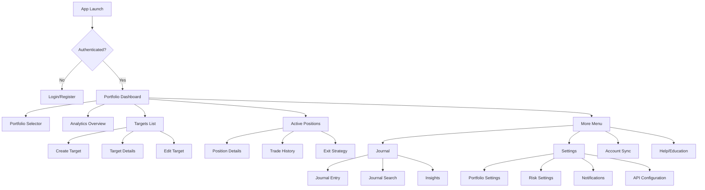
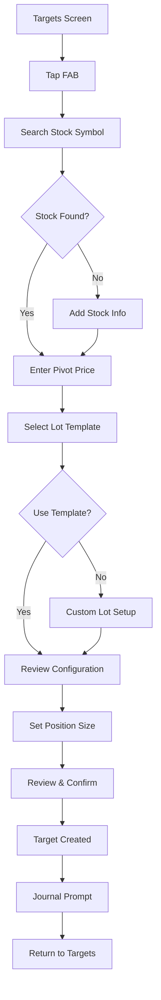
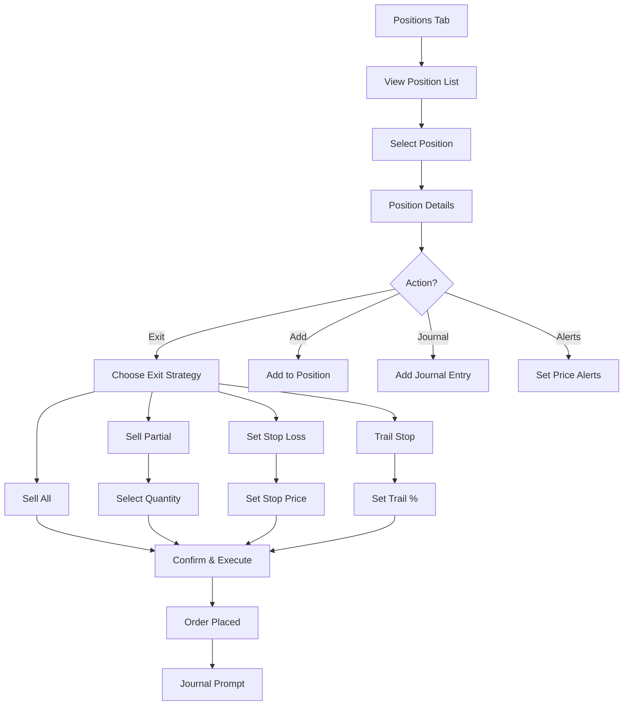
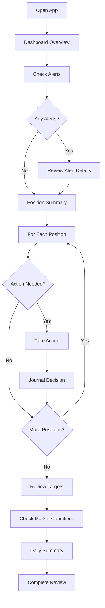

# Zenvestor UI/UX Specification

## Introduction

This document defines the user experience goals, information architecture, user flows, and visual design specifications for Zenvestor's user interface. It serves as the foundation for visual design and frontend development, ensuring a cohesive and user-centered experience.

### Overall UX Goals & Principles

#### Target User Personas

**Primary: The Disciplined CAN SLIM Practitioner**
- Technical professionals who value systematic trading approaches
- 1-2 hours daily commitment (reducible to 15 minutes with Zenvestor)
- Currently using MarketSmith/ThinkorSwim + Excel + scattered journals
- Concentrated portfolios (4-8 stocks typical, up to 15-20 before culling)
- Part of CAN SLIM community (IBD, O'Neil Report, Minervini circles)

**Secondary: The Aspiring Systematic Trader**
- Experienced traders looking to implement more discipline
- Frustrated with emotional decision-making affecting returns
- Seeking automation to execute complex strategies
- Want to learn from their trading patterns

#### Usability Goals

- **Efficiency of use:** Complete daily portfolio review in under 15 minutes
- **Error prevention:** Clear validation and confirmation for all trading actions
- **Immediate feedback:** Every action provides instant visual confirmation
- **Memorability:** Consistent patterns allow muscle memory development
- **Progressive disclosure:** Show complexity only when needed

#### Design Principles

1. **Systematic Calm** - Muted colors with strategic use of green/red, reducing emotional triggers
2. **Information Hierarchy** - Most important data prominently displayed, details on demand
3. **Action Clarity** - Every button/action clearly indicates its consequence
4. **Consistent Patterns** - Similar actions behave identically throughout the app
5. **Mobile-First Focus** - Optimized for one-handed mobile use during market hours

### Change Log

| Date | Version | Description | Author |
|------|---------|-------------|--------|
| 2024-01-XX | 1.0 | Initial UI/UX specification | Sally (UX Expert) |

## Information Architecture (IA)

### Site Map / Screen Inventory

### Navigation Structure

**Primary Navigation:** Bottom tab bar with 4 main sections
- Dashboard (home icon)
- Targets (target icon)
- Positions (chart icon)
- More (menu icon)

**Secondary Navigation:** Contextual actions within each screen
- Floating Action Buttons for primary actions
- Swipe gestures for quick actions
- Long press for additional options

**Breadcrumb Strategy:** Minimal breadcrumbs - rely on clear back navigation and screen titles

## User Flows

### Creating a Trading Target

**User Goal:** Set up a new trading target with multi-lot configuration

**Entry Points:** 
- FAB on Targets screen
- Quick action from Dashboard
- From stock research (future feature)

**Success Criteria:** Target created with pivot price and lot configuration, ready for automatic execution

**Edge Cases & Error Handling:**
- Invalid symbol: Show inline error with suggestion to add stock
- Pivot price validation: Must be within reasonable range of current price
- Insufficient buying power: Calculate and show warning
- Duplicate target: Prompt to edit existing target

**Notes:** Pre-populate with sensible defaults. Allow saving custom templates for frequent configurations.

### Monitoring Active Positions

**User Goal:** Review current positions and make exit decisions

**Entry Points:**
- Positions tab
- Dashboard summary widget
- Push notification for price alerts

**Success Criteria:** User can quickly assess position health and execute exit strategies

**Edge Cases & Error Handling:**
- Market closed: Show warning, offer to queue order
- Insufficient shares: Validate against position size
- Connection error: Queue locally, retry with notification

### Daily Portfolio Review

**User Goal:** Complete morning routine in 15 minutes

**Entry Points:**
- Morning notification
- Dashboard on app open

**Success Criteria:** All positions reviewed, decisions journaled, ready for market open

## Wireframes & Mockups

**Primary Design Files:** [To be created in Figma/Sketch]

### Key Screen Layouts

#### Dashboard
**Purpose:** At-a-glance portfolio health and daily priorities

**Key Elements:**
- Portfolio value and daily P&L (top card)
- Mini charts for each position (swipeable cards)
- Active alerts section
- Quick actions bar
- Market status indicator

**Interaction Notes:** Pull-to-refresh updates all data. Swipe position cards for quick actions. Tap anywhere for details.

**Design File Reference:** [Dashboard_Mobile_v1]

#### Targets Management
**Purpose:** Create and monitor trading targets

**Key Elements:**
- Active targets list with progress indicators
- Sort/filter options (by date, symbol, distance to pivot)
- Floating action button for new target
- Search bar (hidden until pulled down)
- Target status badges (Active, Watching, Triggered)

**Interaction Notes:** Swipe left to edit, swipe right to deactivate. Long press for batch operations.

**Design File Reference:** [Targets_List_v1]

#### Position Details
**Purpose:** Complete position information and management

**Key Elements:**
- Price chart with entry points marked
- P&L summary card
- Position metrics (% gain, R-multiple, hold time)
- Action buttons carousel
- Trade history timeline
- Related journal entries

**Interaction Notes:** Pinch to zoom chart. Swipe between time frames. Scroll for full history.

**Design File Reference:** [Position_Detail_v1]

#### Target Creation Wizard
**Purpose:** Streamlined multi-lot target setup

**Key Elements:**
- Step indicator (1-4 steps)
- Symbol search with autocomplete
- Pivot price input with current price reference
- Visual lot configuration builder
- Position size calculator
- Review summary before confirmation

**Interaction Notes:** Swipe between steps. Real-time validation. Shake to reset form.

**Design File Reference:** [Target_Creation_Flow_v1]

## Component Library / Design System

**Design System Approach:** Custom design system built on Material Design 3 principles, adapted for financial applications with emphasis on data clarity and reduced emotional triggers.

### Core Components

#### PriceDisplay
**Purpose:** Consistent price formatting with color coding

**Variants:** Large (dashboard), Medium (lists), Small (inline), Micro (charts)

**States:** Positive (green), Negative (red), Neutral (gray), Updating (pulse animation)

**Usage Guidelines:** Always show minimum 2 decimal places. Use tabular numbers. Include up/down arrows for changes.

#### PositionCard
**Purpose:** Summarize position information in list views

**Variants:** Expanded (with chart), Collapsed (key metrics only), Mini (dashboard widget)

**States:** Default, Selected, Warning (stop loss near), Alert (target reached)

**Usage Guidelines:** Always show symbol, shares, P&L, and current price. Progressive disclosure for additional metrics.

#### ActionButton
**Purpose:** Primary actions throughout the app

**Variants:** Primary (filled), Secondary (outlined), Danger (red), Success (green)

**States:** Default, Pressed, Disabled, Loading

**Usage Guidelines:** Maximum 2 primary actions per screen. Danger buttons require confirmation. Show loading state for async operations.

#### LotConfigurator
**Purpose:** Visual configuration of multi-lot entries

**Variants:** Template selector, Custom builder, Review mode

**States:** Default, Editing, Invalid, Complete

**Usage Guidelines:** Show visual representation of lots. Validate total equals 100%. Allow drag to adjust percentages.

## Branding & Style Guide

### Visual Identity
**Brand Guidelines:** "Systematic Calm" - Professional financial aesthetic with calming influence

### Color Palette

| Color Type | Hex Code | Usage |
|------------|----------|--------|
| Primary | #1A237E | Headers, primary actions, active states |
| Secondary | #004D40 | Secondary actions, success states |
| Accent | #F57C00 | Alerts, important highlights |
| Success | #2E7D32 | Positive P&L, confirmations |
| Warning | #F9A825 | Cautions, near-trigger alerts |
| Error | #C62828 | Negative P&L, errors, stop losses |
| Neutral | #424242, #757575, #E0E0E0 | Text, borders, backgrounds |

### Typography

#### Font Families
- **Primary:** Inter (clean, highly legible)
- **Secondary:** Roboto (system fallback)
- **Monospace:** JetBrains Mono (prices, numbers)

#### Type Scale

| Element | Size | Weight | Line Height |
|---------|------|---------|-------------|
| H1 | 28sp | Bold | 1.2 |
| H2 | 24sp | SemiBold | 1.25 |
| H3 | 20sp | Medium | 1.3 |
| Body | 16sp | Regular | 1.5 |
| Small | 14sp | Regular | 1.4 |
| Micro | 12sp | Regular | 1.3 |

### Iconography
**Icon Library:** Material Icons with custom financial icons

**Usage Guidelines:** 
- Use outlined style for inactive states
- Filled icons for active/selected states
- Maintain 24dp base size, scale proportionally
- Custom icons for: target, lot, position, journal

### Spacing & Layout
**Grid System:** 8dp base unit grid

**Spacing Scale:** 4, 8, 12, 16, 24, 32, 48, 64

## Accessibility Requirements

### Compliance Target
**Standard:** WCAG 2.1 AA compliance

### Key Requirements

**Visual:**
- Color contrast ratios: 4.5:1 for normal text, 3:1 for large text
- Focus indicators: 2dp border with primary color
- Text sizing: Support up to 200% zoom without horizontal scroll

**Interaction:**
- Keyboard navigation: All functions accessible via external keyboard
- Screen reader support: Semantic labels for all interactive elements
- Touch targets: Minimum 48x48dp

**Content:**
- Alternative text: Chart descriptions for screen readers
- Heading structure: Logical hierarchy throughout
- Form labels: Clear, persistent labels for all inputs

### Testing Strategy
- Automated contrast checking in design phase
- Screen reader testing with TalkBack
- Keyboard navigation verification
- Color blind mode testing

## Responsiveness Strategy

### Breakpoints

| Breakpoint | Min Width | Max Width | Target Devices |
|------------|-----------|-----------|----------------|
| Mobile | 0dp | 599dp | Phones (primary) |
| Tablet | 600dp | 1023dp | Small tablets, large phones |
| Desktop | 1024dp | 1439dp | Tablets in landscape, small laptops |
| Wide | 1440dp | - | External monitors (future) |

### Adaptation Patterns

**Layout Changes:** 
- Mobile: Single column, stacked navigation
- Tablet: Two column for lists/details
- Desktop: Three panel layout possible

**Navigation Changes:**
- Mobile: Bottom tab bar
- Tablet: Rail navigation on left
- Desktop: Persistent rail with labels

**Content Priority:**
- Mobile: Essential information only, details on tap
- Tablet: More information density, side-by-side comparisons
- Desktop: Full information display, multiple panels

**Interaction Changes:**
- Mobile: Touch optimized, swipe gestures
- Tablet: Touch + hover states
- Desktop: Full hover interactions, right-click menus

## Animation & Micro-interactions

### Motion Principles
- Purposeful: Every animation has a clear function
- Subtle: Enhance without distraction
- Consistent: Same duration and easing throughout
- Responsive: Immediate feedback for all interactions

### Key Animations
- **Page Transitions:** Slide horizontal (300ms, ease-in-out)
- **Modal/Dialog:** Fade + scale (250ms, ease-out)
- **List Items:** Stagger fade-in (200ms per item, 50ms delay)
- **Price Updates:** Pulse background (500ms, ease)
- **Loading States:** Skeleton screens with shimmer (1s loop)
- **Success/Error:** Checkmark/X draw (400ms, ease)
- **Pull to Refresh:** Elastic bounce (physics-based)
- **FAB:** Scale + rotate (200ms, ease-out)

## Performance Considerations

### Performance Goals
- **Page Load:** < 2 seconds on 3G
- **Interaction Response:** < 100ms for touch feedback
- **Animation FPS:** Consistent 60 FPS

### Design Strategies
- Skeleton screens during data load
- Progressive image loading for charts
- Virtualized lists for large datasets
- Optimistic UI updates with rollback
- Cached data with update indicators
- Lazy load historical data
- Debounce search inputs (300ms)

## Next Steps

### Immediate Actions
1. Create high-fidelity mockups in Figma
2. Build interactive prototype for user testing
3. Develop custom icon set for financial elements
4. Create component library in Storybook
5. Conduct usability testing with target users

### Design Handoff Checklist
- [x] All user flows documented
- [x] Component inventory complete
- [x] Accessibility requirements defined
- [x] Responsive strategy clear
- [x] Brand guidelines incorporated
- [x] Performance goals established

## Checklist Results

[To be completed after design review]